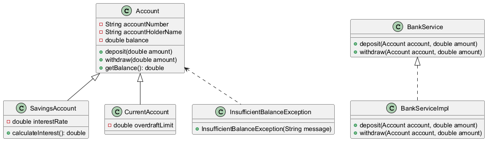

# Simple Banking System

This project is a simple banking system implemented in Java using Object-Oriented Programming (OOP) principles. It provides basic functionalities for managing bank accounts, including savings and current accounts, and supports operations such as deposits, withdrawals, and balance inquiries.

## Features

- **Account Management**: Create and manage savings and current accounts.
- **Transaction Support**: Perform deposits and withdrawals with proper validation.
- **Custom Exceptions**: Handle insufficient balance scenarios with custom exceptions.
- **Service Layer**: Encapsulates business logic for account operations.

## Project Structure

The project follows a modular structure:

- **model/**: Contains the data models for accounts (`Account`, `SavingsAccount`, `CurrentAccount`).
- **service/**: Contains the service layer (`BankService`, `BankServiceImpl`) for business logic.
- **exception/**: Contains custom exceptions (`InsufficientBalanceException`).
- **Main.java**: Entry point of the application.

## Class Diagram

Below is the class diagram for the Simple Banking System:



## How to Run

1. Clone the repository to your local machine.
2. Open the project in your favorite Java IDE (e.g., IntelliJ IDEA).
3. Compile and run the `Main.java` file to start the application.

## Example Usage

```java
public class Main {
    public static void main(String[] args) {
        BankService bankService = new BankServiceImpl();

        // Create accounts
        Account savings = new SavingsAccount("12345", "John Doe", 1000.0);
        Account current = new CurrentAccount("67890", "Jane Doe", 5000.0);

        // Perform transactions
        bankService.deposit(savings, 500.0);
        bankService.withdraw(current, 1000.0);

        // Display balances
        System.out.println("Savings Balance: " + savings.getBalance());
        System.out.println("Current Balance: " + current.getBalance());
    }
}
```

## License

This project is open-source and available under the [MIT License](LICENSE).

## Author

Created by Shymaa Hussien.

## Date

january 20, 2026.
